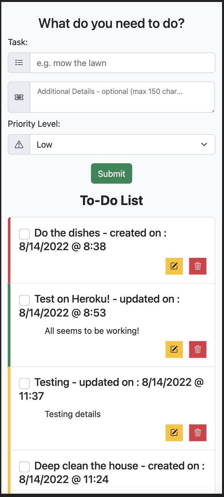

<!-- Badges -->

# SQL To-Do List

## Description

_Duration: 2 Weeks_

Need to keep track of your to-dos? Utilize this simple to-do app!

[Deployed version of app](https://sleepy-dawn-31095.herokuapp.com/)

## Screenshot

### Prerequisites

- [Node.js](https://nodejs.org/en/)

#### Optional
- [nodemon](https://www.npmjs.com/package/nodemon)
- If you don't have nodemon installed you can change the start script in the `package.json` to `"node server/server.js"`

## Installation

1. Create a database named `weekend_to_do_app`,
2. The queries in the `weekend_to_do_app.sql` file are set up to create all the necessary tables and populate the needed data to allow the application to run correctly. The project is built on Postgres, so you will need to make sure to have that installed. I recommend using Postico to run those queries as that was used to create the queries,
3. Open your editor and run `npm install` in your terminal - this will install express, pg, and bootstrap.
2. run `npm start` in your terminal. (Default port is 5000, if port is in use modify `server.js` port variable.)
3. Navigate to `localhost:5000` in browser (if port was modified, use redifined port number)

## Usage

1. As a user, I want to be able to add a task to my to-do list
2. As a user, I want to be able to add details to my tasks
3. As a user, I want to be able to add a priority level to my tasks.
4. As a user, I want to be able to edit my tasks
5. As a user, I want to be able to delete my tasks
6. As a user, I want to be able to mark tasks complete

## Built With

1. 
2. 
3. 
4. 
5. 
6. 
7. 
8. 
9. 

## License

[MIT](https://choosealicense.com/licenses/mit/)

## Acknowledgement

Thanks to [Prime Digital Academy](https://www.primeacademy.io/) and members of the Phrygian cohort who equipped and helped me to make this application a reality.

Also thanks to the Net Ninja you tube channel for offering tutorials on bootstrap. [NetNinja](https://www.youtube.com/playlist?list=PL4cUxeGkcC9joIM91nLzd_qaH_AimmdAR)

## Support

If you have suggestions or issues, please email me at [schuma1022@gmail.com](mailto:schuma1022@gmail.com)

## Future updates

- [ ] Correct form-submit function - currently causes issues on iOS devices
- [ ] Change database fields to use proper types like timestamp and boolean
- [ ] Create custom bootstrap color theme
- [ ] Add Sorting capabilities
- [ ] Add Filtering capabilities
